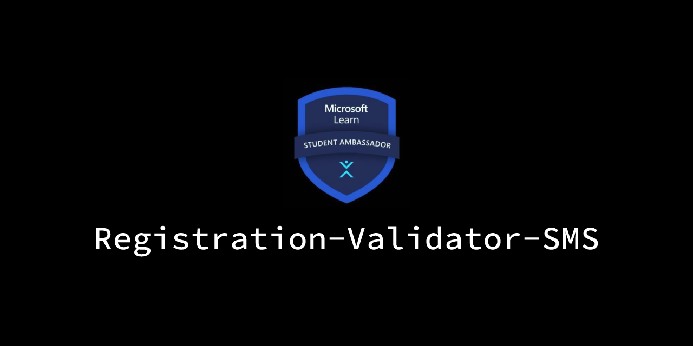
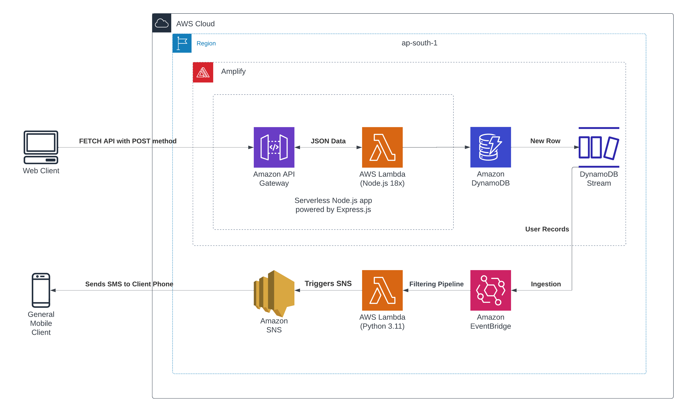

<a href="https://nextf0rm.vercel.app/">
  
  <h1 align="center">Registration Validator SMS</h1>
</a>

<p align="center">
  An open-source web-form app built with Next.js<br>
  Express.js and AWS for the REST API and NoSQL database.<br>Sends SMS to the phone number used for registering
</p>

<p align="center">
  <a href="#features"><strong>Features</strong></a> ·
  <a href="#running-locally"><strong>Running locally</strong></a> ·
  <a href="#overview"><strong>Overview</strong></a> ·
  <a href="#api-routing"><strong>API Routing</strong></a> ·
  <a href="#aws-configuration-for-sns"><strong>AWS Configuration</strong></a> ·
  <a href="#authors"><strong>Authors</strong></a>
</p>


## Features

- **Website**
  - [Next.js](https://nextjs.org) App Router
  - [Amazon Web Services](https://docs.aws.amazon.com/) for backend functionality
  - The [Amplify Framework](https://docs.amplify.aws/) for AWS integration
  - Support for `REST API`, NoSQL Database `DynamoDB`, and `Lambda` functions
  - Edge runtime-ready
  - [shadcn/ui](https://ui.shadcn.com)
    - Styling with [Tailwind CSS](https://tailwindcss.com)
    - [Radix UI](https://radix-ui.com) for headless component primitives
  - [Cross Origin Resource Sharing ](https://aws.amazon.com/what-is/cross-origin-resource-sharing) for legitimate requests only
  - [Zod](https://zod.dev) Typesafe Form Validation ensuring sanitized input is always sent
- **AWS Infrastructure**
  - [DynamoDB](https://aws.amazon.com/dynamodb) Streams enables real-time data processing 
  - [EventBridge](https://aws.amazon.com/eventbridge) acts as a pipeline service 
  - [AWS Lambda](https://aws.amazon.com/lambda) for processing JSON and filtering required data
  - [Amazon SNS](https://aws.amazon.com/sns) for sending SMS to the target user

### Tech Stack


## Overview


A static site is hosted with a contact form. We use `API Gateway` to create an API which makes a `PUT` request to our `DynamoDB` database after the user clicks <kbd>Register</kbd> on the form.

The API sends user records to `DynamoDB` which then pushes the record into the `DynamoDB Data Stream`.

`EventBrige Pipeline` is configured to use `DynamoDB` Data Streams as the `Event Source`, Filter for `INSERT` records in the stream to pick up only new entries. The record data is then pushed to the target `Lambda` function.

`Lambda` performs the processing on the input `JSON` data using `Python` to parse the user data and extract the Phone Number, name and other relevant details to send to SNS.

`Simple Notification Service` publishes a formatted string with user details as an SMS to the provided number, confirming their registration.

## Running locally

First, run the development server:

```bash
npm install
npm run dev
```

Your app template should now be running on [localhost:3000](http://localhost:3000/)

> [!WARNING]
> This command only starts the webapp. You will need to configure the other services on AWS to get the full functionality.

## API Routing

The `REST API` is hosted on AWS using a Lambda function which deploys a `Serverless Express.js app`. Source code for lambda function is in the [`amplify/backend/function/formfunction/src/app.js`](./amplify/backend/function/formfunction/src/app.js)

> [!IMPORTANT]  
> The app template which is running on [localhost:3000](http://localhost:3000/) is using the `REST API` hosted on AWS. It has CORS enabled which means your app template will not be able make requests to the `REST API` hosted on AWS. 

> [!NOTE]
> To learn more about the `Serverless Express.js app` and how to deploy it, visit the [`amplify/README.md`](./amplify/README.md) 

## AWS Configuration for SNS

AWS Serverless infrastructure is used to send users instantaneous confirmation messages via SMS upon registering for an event on a website contact form.

This infrastructure relies on `Eventbridge` and `Lambda` for functionality. `Eventbridge` creates a pipeline which listens for a new stream to the `DynamoDB` table.

The `Lambda` function for processing the input `JSON` data uses `Python` to parse the data and send it to SNS.

> [!NOTE]
> To learn more about the `Eventbridge` & `Lambda` function and how to deploy it, visit the [`lambda-sns/README.md`](./lambda-sns/README.md) 

## Authors

This project is created by [MLSA KIIT](https://mlsakiit.com) team members:

- Sourasish Basu ([@SourasishBasu](https://github.com/SourasishBasu)) - [MLSA KIIT](https://mlsakiit.com)
- Swapnil Dutta ([@rycerzes](https://github.com/rycerzes)) - [MLSA KIIT](https://mlsakiit.com)
## Version
| Version | Date          		| Comments        |
| ------- | ------------------- | --------------- |
| 1.0     | Nov 21th, 2023   | Initial release |

## Future Roadmap
**Website/API**
- [ ] Authentication and Authorization using API Keys
- [ ] HTTPS Validation
- [ ] Input Validation and Sanitization on server side
- [ ] Better Error Handling
  
**AWS Infrastructure**
- [ ] Actual implementation in production
- [ ] Email functionality along with SMS
- [ ] SNS Topic so that other notifications can be published to the same numbers

## Usage

<p align="center"> 
  
   <br><b>Registration Form template</b>
</p>
<br>
<p align="center"> 
  
   <br><b>DynamoDB Table with valid entries</b>
</p>
<br>
<p align="center"> 
  
   <br><b>SMS Example for a valid Registration</b>
</p>

----
